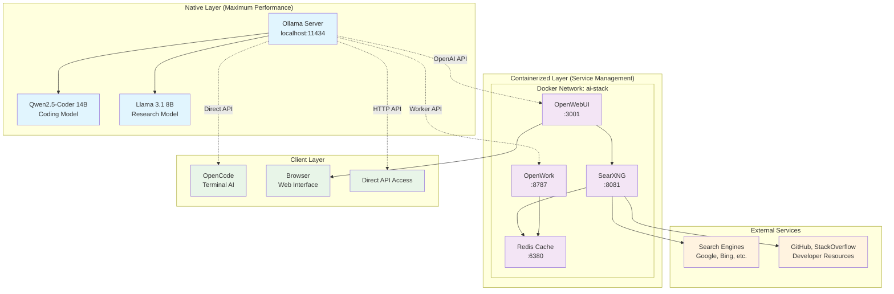
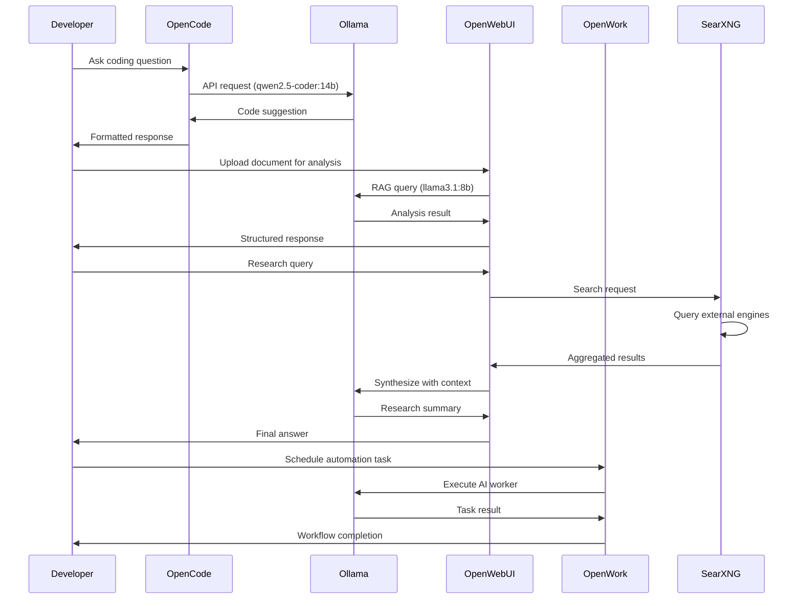

# System Architecture

> **Comprehensive overview of the AI Development Stack architecture and design decisions**

## 🏗️ Architecture Overview

The AI Development Stack employs a **hybrid architecture** designed to maximize performance while maintaining ease of deployment and management.



## 🎯 Design Principles

### 1. Performance First
- **Native Ollama**: AI models run directly on the host for maximum performance
- **No Docker Overhead**: Models access full CPU/RAM without containerization penalty
- **Memory Optimization**: Efficient model loading and memory management

### 2. Developer Experience
- **Single User Optimization**: No authentication overhead in local environment
- **Fast Startup**: Services auto-start and models stay loaded
- **Unified Access**: Multiple interfaces (terminal, web, API) for different workflows

### 3. Privacy & Security
- **Local Processing**: All AI computation happens locally
- **No External APIs**: No dependency on cloud services
- **Privacy-Focused Search**: SearXNG proxies search queries anonymously

### 4. Modularity
- **Service Isolation**: Each component can be updated/replaced independently
- **Configuration Flexibility**: Easy customization for different use cases
- **Extensibility**: Plugin architecture for additional capabilities

## 🏛️ Component Architecture

### Native Layer: Ollama + Models

#### Ollama Server
- **Purpose**: High-performance LLM inference server
- **Location**: Native installation on host OS
- **API**: OpenAI-compatible REST API on port 11434
- **Models**: Specialized coding and research models

```bash
# Ollama Environment Configuration
OLLAMA_HOST=127.0.0.1:11434
OLLAMA_ORIGINS=http://localhost:3001,http://127.0.0.1:3001
OLLAMA_KEEP_ALIVE=24h
OLLAMA_NUM_PARALLEL=2
OLLAMA_MAX_LOADED_MODELS=2
OLLAMA_FLASH_ATTENTION=1
```

#### Model Selection Strategy
| Model | Size | Purpose | Context | Use Case |
|-------|------|---------|---------|----------|
| Qwen2.5-Coder 14B | 9GB | Coding | 32K | Primary coding assistant |
| Llama 3.1 8B | 4.9GB | Research | 128K | Long document analysis |
| Qwen2.5-Coder 7B | 4.7GB | Quick Tasks | 32K | Fast code completion |

### Containerized Layer: Services

#### OpenWebUI
- **Purpose**: Primary AI interface with advanced features
- **Technology**: Python (FastAPI) + Svelte frontend
- **Features**: RAG, multi-model chat, file uploads, web search integration
- **Optimization**: Single-user mode, no authentication overhead

```yaml
# Key Optimizations
environment:
  - DEFAULT_USER_ROLE=admin
  - ENABLE_SIGNUP=false
  - ENABLE_LOGIN=false
  - ENABLE_RAG_HYBRID_SEARCH=true
  - SEARXNG_QUERY_URL=http://searxng:8080/search?q=<query>&format=json
```

#### SearXNG
- **Purpose**: Privacy-focused metasearch engine
- **Technology**: Python Flask application
- **Features**: 242+ search engines, no tracking, JSON API
- **Integration**: Provides web search capability to OpenWebUI

```yaml
# Search Engine Configuration
engines:
  - stackoverflow, github (Developer resources)
  - arxiv, semantic_scholar (Research)
  - google, bing, duckduckgo (General)
```

#### Redis Cache
- **Purpose**: High-performance caching layer
- **Technology**: Redis 7 Alpine
- **Configuration**: Optimized for memory efficiency with LRU eviction
- **Usage**: SearXNG result caching, session storage, OpenWork task queue

#### OpenWork Platform
- **Purpose**: Enterprise-grade AI automation and workflow management
- **Technology**: Node.js with Express backend, React frontend
- **Features**: Worker management, task scheduling, approval workflows, browser automation
- **Integration**: Connects to Ollama models via API, uses Redis for task queuing

```yaml
# OpenWork Configuration
environment:
  - OPENWORK_OLLAMA_URL=http://host.docker.internal:11434
  - OPENWORK_REDIS_URL=redis://redis:6379
  - OPENWORK_LOG_LEVEL=info
  - OPENWORK_MAX_WORKERS=5
```

### Client Layer: Access Points

#### OpenCode (Terminal)
- **Purpose**: Terminal-based AI assistant
- **Technology**: Go-based CLI application
- **Integration**: Direct connection to Ollama API
- **Features**: LSP integration, file context, agent system

#### Web Interface
- **Purpose**: Rich browser-based interface
- **Access**: http://localhost:3001
- **Features**: Full OpenWebUI feature set
- **Optimization**: Single-user optimized settings

#### Direct API Access
- **Purpose**: Programmatic access to AI models
- **Endpoint**: http://localhost:11434
- **Compatibility**: OpenAI API format
- **Usage**: Custom integrations, scripts, notebooks

#### OpenWork Web Interface
- **Purpose**: AI automation and workflow management
- **Access**: http://localhost:8787
- **Features**: Worker dashboard, task management, approval workflows
- **Integration**: Team collaboration and automated AI workflows

## 🔌 Network Architecture

### Port Allocation
```
┌─────────────────┬──────┬────────────────────────┐
│ Service         │ Port │ Purpose                │
├─────────────────┼──────┼────────────────────────┤
│ Ollama          │ 11434│ AI Model API           │
│ OpenWebUI       │ 3001 │ Web Interface          │
│ SearXNG         │ 8081 │ Search Interface       │
│ OpenWork        │ 8787 │ AI Automation Platform │
│ Redis           │ 6380 │ Cache (internal)       │
│ Nginx (optional)│ 80   │ Reverse Proxy          │
└─────────────────┴──────┴────────────────────────┘
```

### Service Communication
```
OpenWebUI ─────────┐
                   ├──► host.docker.internal:11434 ──► Ollama
OpenCode ──────────┘
OpenWork ──────────┘

SearXNG ──► Redis Cache
        ──► External Search Engines

OpenWebUI ──► SearXNG (for web search)
OpenWork  ──► SearXNG (for research tasks)
          ──► Redis Cache (for task storage)
```

### Docker Networking
- **Network**: `ai-stack` bridge network (172.20.0.0/16)
- **Host Access**: `host.docker.internal` for native Ollama access
- **Service Discovery**: Docker DNS for inter-service communication

## 📊 Resource Management

### Memory Allocation Strategy

```
Total System: 30GB RAM
├── Ollama + Models: ~18GB
│   ├── Qwen2.5-Coder 14B: ~9GB
│   ├── Llama 3.1 8B: ~5GB
│   └── Ollama Overhead: ~4GB
├── Docker Services: ~5GB
│   ├── OpenWebUI: ~1-2GB
│   ├── SearXNG: ~1GB
│   ├── OpenWork: ~512MB-1GB
│   └── Redis: ~512MB
├── System + Other: ~5GB
└── Available Buffer: ~2GB
```

### CPU Optimization
- **Native Ollama**: Full CPU access without containerization
- **Container Limits**: Resource limits prevent interference
- **NUMA Awareness**: Ollama can utilize NUMA topology

### Storage Strategy
```
Storage Layout:
├── /home/daniel/.ollama/models (Native Ollama models)
├── ./data/open-webui (Persistent data)
├── ./data/searxng (Search cache)
└── ./config/ (Configuration files)
```

## 🔒 Security Architecture

### Local Security Model
- **No External Dependencies**: All processing happens locally
- **Minimal Attack Surface**: Only necessary ports exposed
- **Container Isolation**: Services run in isolated containers
- **No Authentication**: Single-user setup with no auth overhead

### Network Security
```
Firewall Rules (Recommended):
┌─────────┬─────────┬─────────────────┐
│ Port    │ Access  │ Purpose         │
├─────────┼─────────┼─────────────────┤
│ 3001    │ Local   │ OpenWebUI       │
│ 8081    │ Local   │ SearXNG         │
│ 11434   │ Local   │ Ollama API      │
│ 6380    │ Internal│ Redis (blocked) │
└─────────┴─────────┴─────────────────┘
```

### Data Privacy
- **Local Processing**: No data leaves the system
- **Anonymous Search**: SearXNG proxies external queries
- **No Telemetry**: All tracking disabled in services

## 🚀 Performance Characteristics

### Response Time Expectations
```
Model Performance (Intel Core Ultra 9 185H):
├── Qwen2.5-Coder 14B: 8-15 tokens/second
├── Llama 3.1 8B: 15-25 tokens/second
└── Qwen2.5-Coder 7B: 25-40 tokens/second
```

### Scalability Limits
- **Concurrent Users**: Optimized for 1 primary user
- **Model Switching**: Hot-swap without service restart
- **Context Length**: Up to 128K tokens (Llama 3.1)
- **File Processing**: Handles large codebases and documents

### Optimization Features
- **Model Preloading**: Keep frequently used models in memory
- **Aggressive Caching**: Redis caches search results and sessions
- **Connection Pooling**: Efficient HTTP connection management
- **Memory Management**: Automatic cleanup and garbage collection

## 🔄 Data Flow

### Typical Development Workflow


### File Processing Pipeline
```
Document Upload → RAG Processing → Vector Storage → Query Enhancement → AI Response
```

## 🔧 Configuration Management

### Environment Variables
- **Ollama**: Native system environment
- **Docker**: Environment files and compose variables
- **OpenCode**: JSON configuration files

### Configuration Hierarchy
```
Configuration Priority:
1. Environment variables (.env)
2. Service-specific configs (config/)
3. Default values (built-in)
4. Runtime overrides (command line)
```

## 📈 Monitoring & Observability

### Health Checks
- **Ollama**: API endpoint monitoring
- **OpenWebUI**: Container health checks
- **SearXNG**: Search functionality tests
- **Redis**: Memory and connection monitoring

### Logging Strategy
```
Log Aggregation:
├── Ollama: systemd journal
├── Docker Services: docker logs
├── System: syslog
└── Application: service-specific logs
```

## 🔮 Future Extensibility

### Planned Enhancements
- **Multi-GPU Support**: Distribution across multiple GPUs
- **Model Quantization**: GGUF format support for efficiency
- **Advanced RAG**: Vector database integration
- **API Gateway**: Rate limiting and load balancing

### Plugin Architecture
- **Custom Models**: Easy addition of new models
- **Search Engines**: Additional SearXNG engines
- **Monitoring**: Prometheus/Grafana integration
- **Backup**: Automated data backup strategies

This architecture provides a robust, performant, and privacy-focused AI development environment optimized for single-user coding and research workflows while maintaining extensibility for future enhancements.